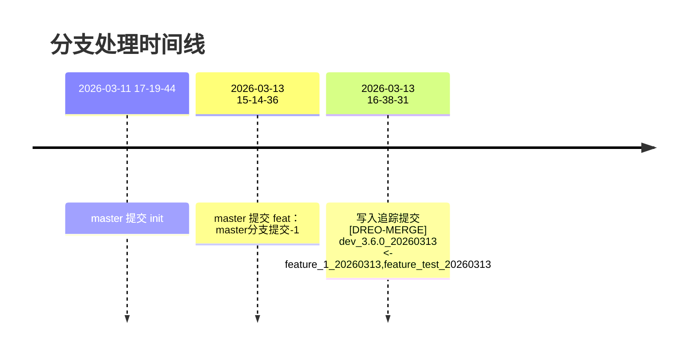
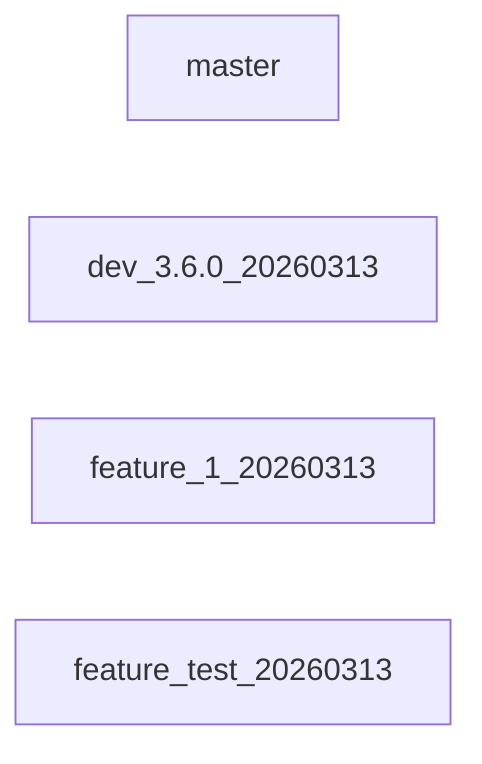

# Git 分支合并报告

- 仓库路径：`/Users/xue/file/claude/branchManager/test`
- 生成时间：`2026-03-13 16:39:16`
- 基线分支：`master`
- 当前分支：`dev_3.6.0_20260313`

## 分支概览

- `dev_3.6.0_20260313`
- `feature_1_20260313`
- `feature_test_20260313`
- `master`

## 推断的处理顺序

1. 2026-03-11 17:19:44：master 提交 init（c085921）
2. 2026-03-13 15:14:36：master 提交 feat: master分支提交-1（2e5a461）
3. 2026-03-13 16:38:31：写入追踪提交 [DREO-MERGE] dev_3.6.0_20260313 <- feature_1_20260313,feature_test_20260313（0cb1cf7）

## 时间线图

## 分支流转图

## 追踪提交

- 2026-03-13 16:38:31+08:00  [DREO-MERGE] dev_3.6.0_20260313 <- feature_1_20260313,feature_test_20260313 (0cb1cf7)
